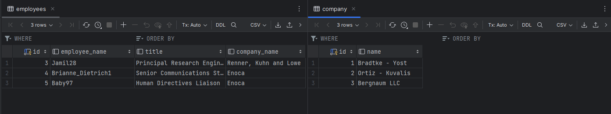
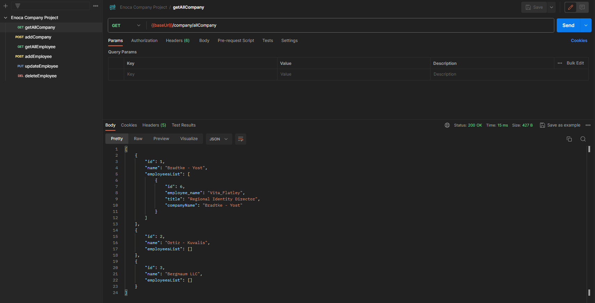
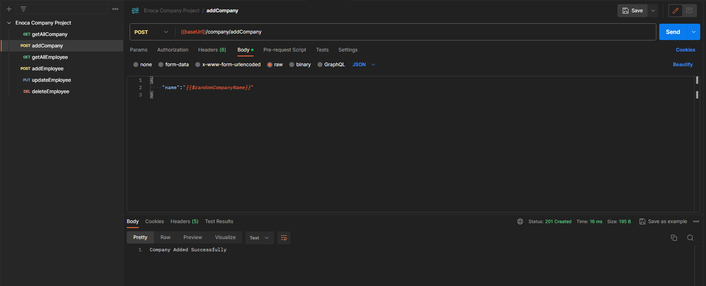
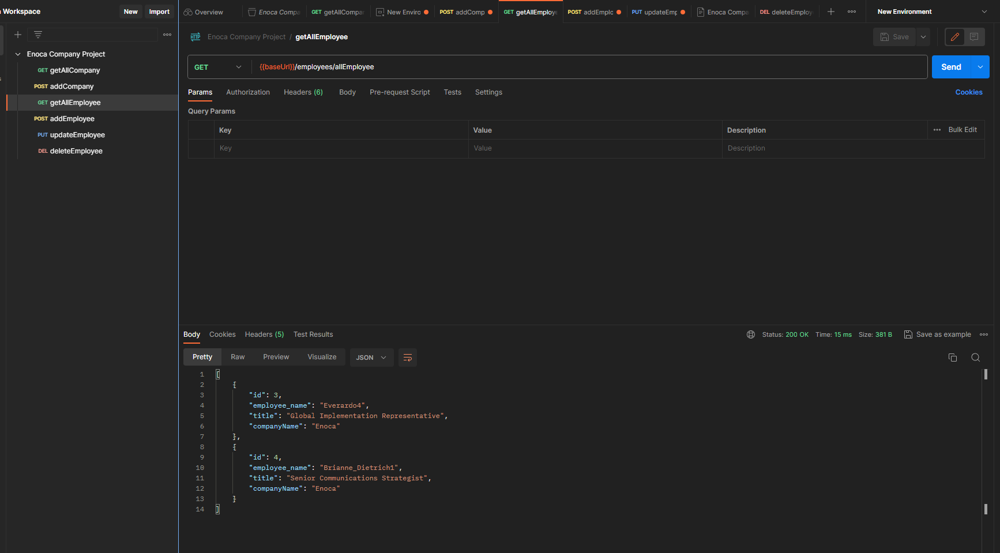
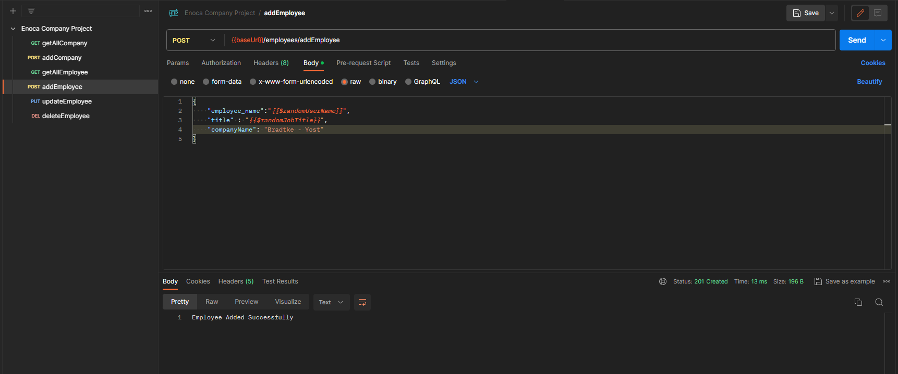
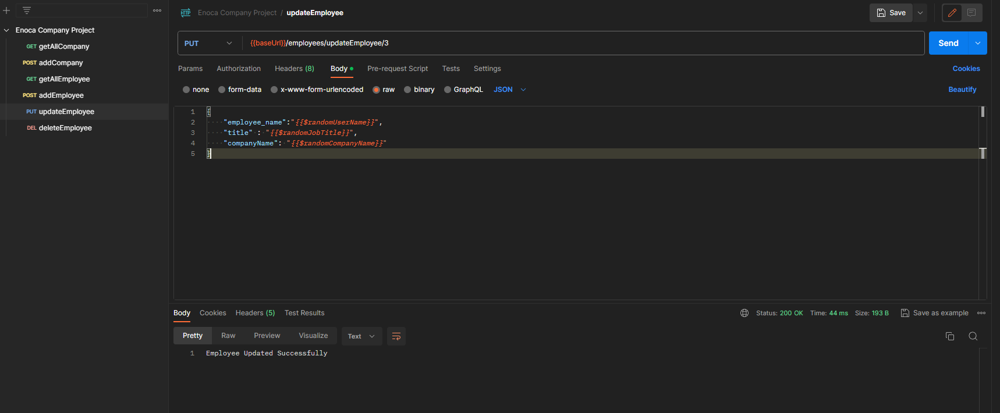
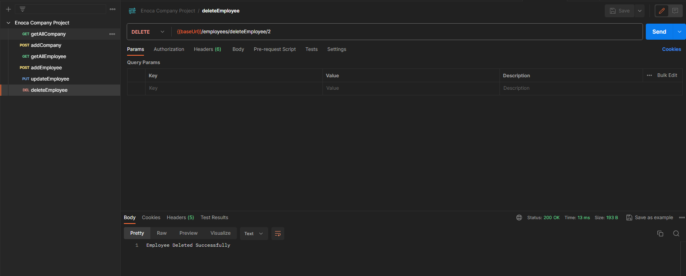

<h1> Enoca SpringBoot Challenge</h1>
<hr>

<h3> Kullanılan Teknoloji </h3>
<ul>
<li>Java 17 </li>
<li>SpringBoot 3.2.0 </li>
<li>Spring JPA </li>
<li>Lombok </li>
<li> MySQL Database</li>
</ul>


<p> Projemde çalışanlar ve çalışanların ait olduğu şirketleri yöneten bir managment system tasarlamaya çalıştım</p>
<p> Projeyi görsellerle adım adım anlatmaya çalışacağım. Keyifli okumalar...
<p> İlk olarak veritabanı bağlantısını oluşturmayla başlayalım.
<p> resources/application.properties içerisinde veritabanı ve hibernate konfigürasyınlarını gerçekleştirelim.

```
spring.jpa.hibernate.ddl-auto=update
spring.datasource.url=jdbc:mysql://${MYSQL_HOST:localhost}:PORT/DATABASE_NAME
spring.datasource.username=DATABASE-USERNAME
spring.datasource.password=DATABASE-PASSWORD
spring.datasource.driver-class-name=com.mysql.cj.jdbc.Driver

```
<p> Mysql.Jdbc.Driver kütüphanesini application.properties içerisine ekleyebilmek için eğer maven kullanıyorsanız pom.xml içerisine, gradle kullanıyorsanız dependency bölümüne ilgili Driver'ı eklemeniz gerekiyor.(Spring.initialized içerisinden MySQL driver dependency ekleyebilirsiniz!!)
<p> Proje MVC ( Model - View - Controller) Tasarım kalıbını kullanarak tasarlanmıştır.
Model katmanında entity classlarımızı oluşturuyoruz. Bazı projelerde model katmanı içerisinde service, repository katmanları da bulunuyor fakat karmaşıklığı azaltmak için model katmanı dışarısında kullanmayı tercih ettim.
<p><strong> Model - Company.class </strong></p>

 ```
@Entity
@Getter
@Setter
@Table(name = "company")
public class Company {
    @Id
    @GeneratedValue(strategy = GenerationType.IDENTITY)
    private Integer id;
    private String name;
    @OneToMany(fetch = FetchType.LAZY, cascade = CascadeType.ALL)
    @JoinColumn(name = "company_name", referencedColumnName = "name")
    private List<Employees> employeesList;
}

```
<p> Lombok kütüphanesi ile getter ve setter metodlarımızı anotasyon kullanarak springboot'un arka planda yapmasını sağladık
<p> Birden fazla table kullandığımız için entity class'da table name de belirtmemiz gerekiyor.
<p> Burada bir şirketin birden fazla çalışanı olacağını belirtmek için @OneToMany anotasyonu ekledik. Aynı şekilde Employees.class'ımızıda oluşturuyoruz.
<p><strong> Model - Employees.class </strong></p>

 ```
@Entity
@Getter
@Setter
@Table(name = "employees")
public class Employees {
    @Id
    @GeneratedValue(strategy = GenerationType.IDENTITY)

    private Integer id;
    @Column(name = "employee_name")
    private String employee_name;
    @Column(name = "title")
    private String title;
    @Column(name = "company_name")
    private String companyName;

    @ManyToOne
    @JoinColumn(name = "company_name", referencedColumnName = "name", insertable = false, updatable = false)
    @JsonBackReference
    private Company company1;

}

```
<p> Burada da çalışanların sadece bir şirkete ait olacağını @ManyToOne ile belirtiyoruz
<p><strong>Controller - CompanyController</strong></p>


 ```
@RestController
@RequestMapping("/company")
public class CompanyController {

    @Autowired
    private CompanyService companyService;

    @GetMapping("/allCompany")
    public List<Company> getAllCompany(){
        return companyService.getAllCompanyMethod();
    }

    @PostMapping("/addCompany")
    public ResponseEntity<String> addCompany(@RequestBody Company company){
        return companyService.addCompanyMethod(company);
    }


}

```
<p> Uç url belirtmek için RequestMapping kullanıyoruz ve iki adet endpoint yazıyoruz. Bunlardan ilki Get Http metodu ile servisimizden gelen tüm company kayıtlarını liste halinde döndürmekte. İkinci endpointimiz ise içerisine Company türünde bir reuestBody parametresi isteyerek company kaydını veritabanına eklemektedir.
<p>Aynı mantıkta bu sefer çalışanlara ait enpointler barındıran EmployeesController yazıyoruz.
<p><strong>Controller - EmployeesController</strong> </p>

 ```
@RestController
@RequestMapping("/employees")
public class EmployeesController {

    @Autowired
    private EmployeesService employeesService;

    @GetMapping("/allEmployee")
    public List<Employees> getAllEmployee() {
       return employeesService.getAllEmployeeMethod();
    }

    @PostMapping("/addEmployee")
    public ResponseEntity<String> addEmployee(@RequestBody Employees employees){
        return employeesService.addEmployeeMethod(employees);
    }

    @PutMapping("/updateEmployee/{id}")
    public ResponseEntity<String> updateEmployee(@PathVariable int id, @RequestBody Employees employees){
        return employeesService.updateEmployeeMethod(id, employees);
    }

    @DeleteMapping("/deleteEmployee/{id}")
    public ResponseEntity<String> deleteEmployee(@PathVariable int id){
        return employeesService.deleteEmployeeMethod(id);
    }
}

```
Burada da tüm çalışanları getiren, çalışan ekleyen, çalışanları güncelleyen ve id ye göre çalışanları silen endpointlerimiz mevcuttur.
Son olarak Service classlarımızı belirtelim. Controller classlarımız içerisinde iş kurallarını yazmak MVC başta olmak üzere Clean Code mantığına aykırı olacağından dolayı iş kurallarımız için service classları oluşturuyoruz. Repositoryden aldığımız CRUD operasyonlarını servis classlarımıza autowired ederek db işlemlerini JPA teknolojisini kullanarak yapabiliyoruz


<p><strong>Service - CompanyService </strong></p>

 ```
@Service
public class CompanyService {

    @Autowired
    private CompanyRepository companyRepository;

    public List<Company> getAllCompanyMethod(){

        return companyRepository.findAll();
    }

    public ResponseEntity<String> addCompanyMethod(Company company) {
        companyRepository.save(company);
        return ResponseEntity.status(HttpStatus.CREATED).body("Company Added Successfully");

    }


}

```

Yukarıda belirttiğim gibi JPA teknolojisini kullanabilmek için repository interface'sini @Autowired anotasyonunu kullanarak aslında Dependency Injection yapıyoruz. Bağımlılığı classlardan alıp uygulama çatısına entegre ediyoruz.
Ardından controller da her bir enpointe ait service metodlarımızı tanımlayarak iş kurallarını yazıyoruz. Örneğin tüm company içeriğini almak için JPA'nın findAll() özelliğini controller'a return ediyoruz. Eğer mimaride view (frontend) kısmı olsaydı dönen return ifadesi view'e aktarılarak UI işlemi gerçekleştirilip son kullanıcıya görsel bir data gösterimi sağlanırdı
Şuan sadece Backend isteklerini yönttiğimiz bir proje yazıyoruz. Bu sebepten projenin testini Web sayfası veya uygulama yerine Postmanda yapıcaz. Aşağıda Postmanda testlerini yaptığım resimler mevcuttur.
Son olarak EmployeeService'yi tanımlayalım

<p><strong>Service - EmployeeService </strong></p>

 ```
@Service
public class EmployeesService {

    @Autowired
    private EmployeesRepository employeesRepository;


    public List<Employees> getAllEmployeeMethod() {

        return employeesRepository.findAll() ;
    }

    public ResponseEntity<String> addEmployeeMethod(Employees employees) {
        Employees newEmployee = new Employees();
        newEmployee.setEmployee_name(employees.getEmployee_name());
        newEmployee.setTitle(employees.getTitle());
        newEmployee.setCompanyName(employees.getCompanyName());
        employeesRepository.save(newEmployee);

        return ResponseEntity.status(HttpStatus.CREATED).body("Employee Added Successfully");
    }

    public ResponseEntity<String> updateEmployeeMethod(int id, Employees employees) {
        Employees updateEmployees = employeesRepository.findById(id).get();
        updateEmployees.setEmployee_name(employees.getEmployee_name());
        updateEmployees.setTitle(employees.getTitle());
        updateEmployees.setCompanyName(employees.getCompanyName());
        employeesRepository.save(updateEmployees);
        return ResponseEntity.status(HttpStatus.OK).body("Employee Updated Successfully");
    }

    public ResponseEntity<String> deleteEmployeeMethod(int id) {
        employeesRepository.deleteById(id);
        return ResponseEntity.status(HttpStatus.OK).body("Employee Deleted Successfully");
    }
}

```

<p>Repository interfacelerimizi repository klasörünün altında görebilirsiniz.</p>
<p>Ayriyetten kullandığımız anotasyonlara gelirsek isimlerinde de anlaşılacağı gibi aslında her bir katmanı SpringContainer'a tanıtıyoruz. Yani SpringBoot yardımcı olmak için bizden sadece hangi sınıfın hangi işi yaptığını bana anotasyonla söyleyin run edildiğinde ben bunları sırasıyla çalıştırabileyim diyor. </p>

<h2>Postman da atılan Requestler ve dönen Response değerlerini gösteren görseller </h2>
<strong>Database </strong>



<strong>Tüm şirketleri getiren GET isteği ve sonucu </strong>




<strong>Şirket ekleme </strong>




<strong>Tüm çalışanları listeleme </strong>




<strong>Çalışan ekleme </strong>




<strong>Çalışanları güncelleme </strong>




<strong>Id değerine göre çalışan silme </strong>





